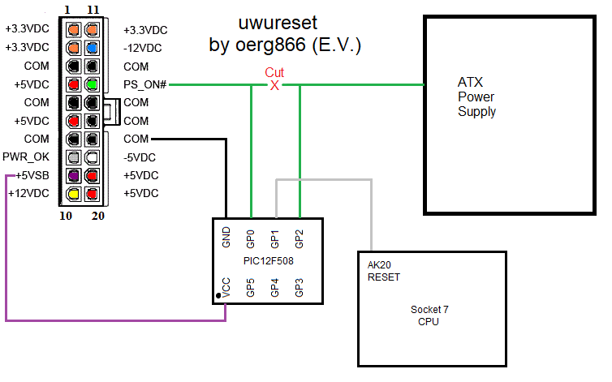

# UWURESET

**uwureset** is a small project that uses a PIC microcontroller to power cycle a standard ATX-based computer as soon as the CPU reset line is toggled. In essence it turns soft-resets into hard-resets (or more accurately, physical power-cylces).

You can use it with other CPU types I imagine, but I use it with an AMD K6-II on an EPoX EP-51 MVP3E. 

## Why?

My AMD K6 system is based on the VIA (M)VP3 chipsets. And since I really wanted to use some nicer SCSI hard disks, I decided to use an Adaptec 39160 SCSI controller. Unforutnately this series of chipsets seems to have an incompatibility with that particular SCSI controller. On reboots (i.e. not when the system is turned on using the power button), the SCSI bios hangs during the bus scan / device detection stage. So I decided to make a gadget that power cycles the machine properly whenever there is activity on the processor's reset line. 

## Usage

**This is a project for a PIC12F508 chip. You must alter the source to make it run on other chips!**

- (OPTIONAL) Assemble into a HEX file using MPLAB. This is optional because the repo includes a pre-assembled hex file. 
- Write HEX file onto a PIC12F508
- Connect the PIC chip to the system using the schematic.

## Schematic

## Pictures

## Note

This is my first PIC project and I made everything up as I went along. The code is not pretty and just about gets the job done :-) 

I did all of this on my twitch stream which you are welcome to check out:

https://twitch.tv/clarryow

Or you can check the [VOD](https://www.twitch.tv/videos/1111163979) for when I did this :-). At the time of writing I'm generally streaming how I build and set up the machine, and even when I play some older games on it :-)

## License

[CC-BY-NC 3.0, click here for info](https://creativecommons.org/licenses/by-nc/3.0)